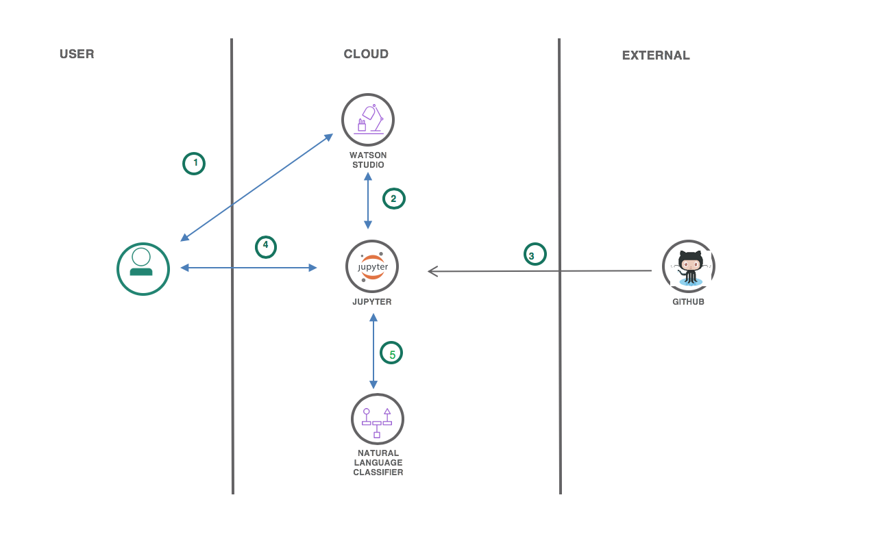
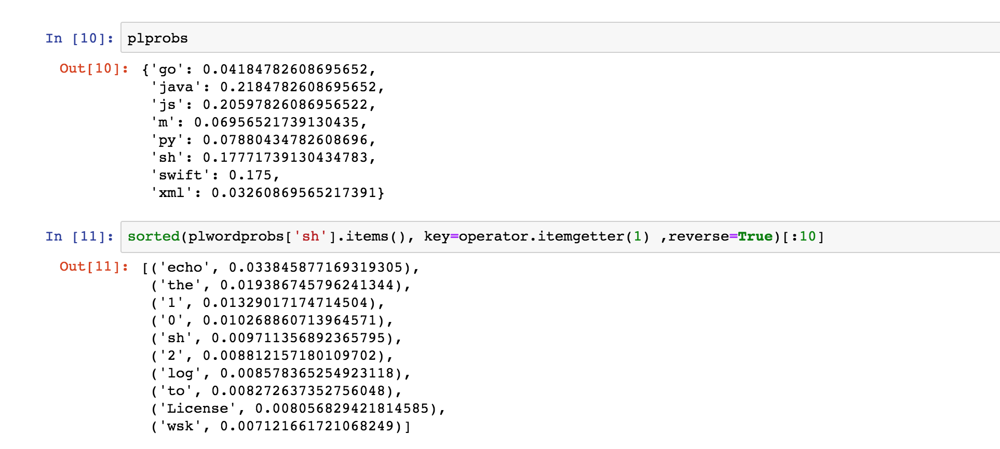

# Programming Language Classification with IBM Watson Studio, Watson, and GitHub

## Description
In this Code Pattern, we will use Jupyter Notebooks in IBM Watson Studio to build a model that predicts a code's programming language based on its text. The model will then be evaluated using IBM's Watson Natural Language classifier.

When the reader has completed this Code Pattern, they will understand how to:

* Build a labeled data set.
* Use Watson Natural Language Classifier to create a predictive model.
* Build a predictive model within a Jupyter Notebook.
* Configure and use Watson APIs.

## Flow

1. The developer creates an IBM [Watson Studio Workspace](https://dataplatform.ibm.com).
1. Using Watson Studio, the developer creates a Jupyter notebook and [Watson Natural Language Classifier](https://www.ibm.com/watson/services/natural-language-classifier/) instance.
1. User can create a new dataset from Github, or use exsiting one in this repo.
1. User interacts with notebook to Build Naive Bayes Classifier and Natural Language Classifier instance using the [Watson Developer Cloud SDK](https://github.com/watson-developer-cloud)
1. The notebook Python code can use NLC apis to create and use a classifier.

## Included components

* [Watson Studio](https://www.ibm.com/bs-en/marketplace/data-science-experience): Analyze data using RStudio, Jupyter, and Python in a configured, collaborative environment that includes IBM value-adds, such as managed Spark.
* [Jupyter Notebook](http://jupyter.org/): An open source web application that allows you to create and share documents that contain live code, equations, visualizations, and explanatory text.
* [Watson Natural Language Classifier](https://www.ibm.com/watson/services/natural-language-classifier/): Understand the intent behind text passages though custom classifiers, complete with a confidence score.

## Featured technologies

* [Artificial Intelligence](https://medium.com/ibm-data-science-experience): Artificial intelligence can be applied to disparate solution spaces to deliver disruptive technologies.
* [Python](https://www.python.org/): Python is a programming language that lets you work more quickly and integrate your systems more effectively.

# Watch the Video

TBD

# Steps

1. [Sign up for the Watson Studio](#1-sign-up-for-watson-studio)
1. [Create a project and add services](#2-create-a-project-and-add-services)
1. [Create a notebook](#3-create-the-notebook)
1. [Create a project in Watson Studio](#2-create-a-project-in-watson-studio-and-bind-it-to-your-watson-machine-learning-service-instance)
1. [Create a notebook in Watson Studio](#3-create-a-notebook-in-watson-studio)
1. [Run the notebooks in Watson Studio](#4-run-the-notebook-in-watson-studio)

### 1. Sign up for Watson Studio

Sign up for IBM's [Watson Studio](https://dataplatform.ibm.com). By creating a project in Watson Studio a free tier ``Object Storage`` service will be created in your IBM Cloud account. Take note of your service names as you will need to select them in the following steps.

> Note: When creating your Object Storage service, select the ``Free`` storage type in order to avoid having to pay an upgrade fee.

## 2. Create a project and add services

* In Watson Studio create a new project which will contain the notebook and connections to the IBM Cloud services. Choose the `Data Science` project tile.
* Associate the project with a Natural Language Classifier service instance. Go to `Settings` tab in the new Project and scroll down to `Associated Services`. Click + and select `Watson` from the drop-down menu. Select an existing `Watson Natural Language Classifier` service or create a new one for free.
* Once your `Natural Language Classifier` (NLC) service is created, copy the credentials and save them for later, when you will use them in your Jupyter notebook.

### 3. Create a notebook in Watson Studio

* In the `Assets` tab of the new project, select `Notebooks` -> `+ New notebook` OR select `+ Add to project` -> `Notebook`.
* Select the `From URL` tab.
* Enter a name for the notebook.
* Optionally, enter a description for the notebook.
* Under `Notebook URL` provide the following url: `https://raw.githubusercontent.com/IBM/programming-language-classifier/master/notebooks/buildmodels.ipynb`
* Click the `Create` button.

### 4. Run the notebook in Watson Studio

* Place your cursor in the first code block in the notebook.
* Click on the `Run` icon to run the code in the cell.
* Move your cursor to each code cell and run the code in it. Read the comments for each cell to understand what the code is doing.

 **Important** when the code in a cell is still running, the label to the left changes to **In [\*]**:.
  Do **not** continue to the next cell until the code is finished running, and the [\*] has changed to a number.

* When you get to the cell that says `## 3.0 Create Classifier with Watson NLC and Evaluate Classification Accuracy`, insert the username and password that you saved from your Watson Natural Language Classifier instance into the code before running it.
* When you get to the cell that says `3.2 Add Classifier ID`, Add the `classifier_id` that is in the output after running `3.1 Create Classifier`.
* Continue running each cell until you finish the entire notebook.

# Sample output

To see the notebook with sample output, load [`examples/exampleNotebook.ipynb`](examples/exampleNotebook.ipynb).

# Learn more

* **Artificial Intelligence Code Patterns**: Enjoyed this Code Pattern? Check out our other [AI Code Patterns](https://developer.ibm.com/code/technologies/artificial-intelligence/).
* **Data Analytics Code Patterns**: Enjoyed this Code Pattern? Check out our other [Data Analytics Code Patterns](https://developer.ibm.com/code/technologies/data-science/)
* **AI and Data Code Pattern Playlist**: Bookmark our [playlist](https://www.youtube.com/playlist?list=PLzUbsvIyrNfknNewObx5N7uGZ5FKH0Fde) with all of our Code Pattern videos
* **With Watson**: Want to take your Watson app to the next level? Looking to utilize Watson Brand assets? [Join the With Watson program](https://www.ibm.com/watson/with-watson/) to leverage exclusive brand, marketing, and tech resources to amplify and accelerate your Watson embedded commercial solution.
* **Watson Studio**: Master the art of data science with IBM's [Watson Studio](https://dataplatform.ibm.com/)

# License

[Apache 2.0](LICENSE)
