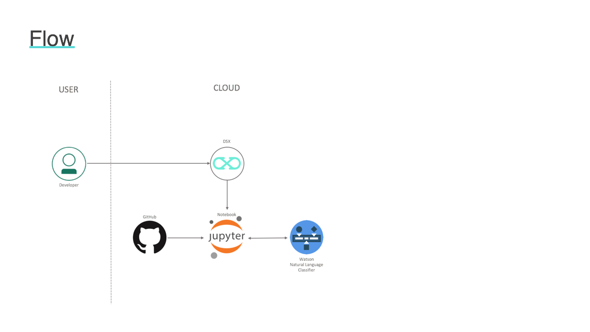

# Work In Progress. Please re-visit soon for the complete Pattern

# Programming Language Classification with IBM Watson Studio, Watson, and GitHub

## Description
In this Code Pattern, we will use Jupyter Notebooks in IBM Watson Studio to build a model that predicts a code's programming language based on its text. The model will then be evaluated using IBM's Watson Natural Language classifier.

When the reader has completed this Code Pattern, they will understand how to:

* Build a labeled data set.
* Use Watson Natural Language Classifier to create a predictive model.
* Build a predictive model within a Jupyter Notebook.
* Configure and use Watson APIs.

## Flow
1. The developer creates an IBM Watson Studio Workspace.
2. Watson Studio depends on an Apache Spark service.
3. IBM Data Science Experience uses Cloud Object storage to manage your data.
4. This lab is built around a Jupyter Notebook, this is where the developer will gather data, train, and evaluate their model.
5. Create GitHub dataset.
6. Build Naive Bayes Classifier
7. Configure Watson Natural Language Understanding
8. Evaluate Models

## Included components
* [Watson Studio](https://www.ibm.com/bs-en/marketplace/data-science-experience): Analyze data using RStudio, Jupyter, and Python in a configured, collaborative environment that includes IBM value-adds, such as managed Spark.
* [Jupyter Notebook](http://jupyter.org/): An open source web application that allows you to create and share documents that contain live code, equations, visualizations, and explanatory text.
* [Watson Natural Language Classifier](https://www.ibm.com/watson/services/natural-language-classifier/): Understand the intent behind text passages though custom classifiers, complete with a confidence score.

## Featured technologies
* [Artificial Intelligence](https://medium.com/ibm-data-science-experience): Artificial intelligence can be applied to disparate solution spaces to deliver disruptive technologies.
* [Python](https://www.python.org/): Python is a programming language that lets you work more quickly and integrate your systems more effectively.

# Watch the Video
TBD

# Steps
1. [Sign up for the Watson Studio](#1-sign-up-for-watson-studio)
1. [Create a project in Watson Studio](#2-create-a-project-in-watson-studio-and-bind-it-to-your-watson-machine-learning-service-instance)
1. [Create a notebook in Watson Studio](#3-create-a-notebook-in-watson-studio)
1. [Run the notebooks in Watson Studio](#4-run-the-notebook-in-watson-studio)

## 1. Sign up for Watson Studio

Sign up for IBM's [Watson Studio](https://dataplatform.ibm.com). By creating a project in Watson Studio a free tier ``Object Storage`` service will be created in your IBM Cloud account. Take note of your service names as you will need to select them in the following steps.

> Note: When creating your Object Storage service, select the ``Free`` storage type in order to avoid having to pay an upgrade fee.

### 2. Create a project in Watson Studio

* From the [Watson Studio](https://datascience.ibm.com) dashboard, click on `New Project` from the dashboard, select a `Complete` project.

  

* Projects depend on two services: Object Storage, and a Compute Engine.  If you don't already have Object Storage or a Compute Engine, you can create a new instance of each service while defining a new project.  The _New Project_ panel is easy to use, either select an existing service on the right, or create a new one.  In the example below services need to be created.

  

> Note: Services created must be in the same region, and space, as your Watson Studio service.

### 3. Create a notebook in Watson Studio

* In [Watson Studio](https://dataplatform.ibm.com), click on `Create notebook` to create a notebook.
* In your project, either click `+ Add to project` -> `Notebook` or in the `Assets` tab, select the `Create notebook` option.
* Select the `From URL` tab.
* Enter a name for the notebook.
* Optionally, enter a description for the notebook.
* Under `Notebook URL` provide the following url: `https://github.com/IBM/programming-language-classifier/tree/master/notebooks/buildmodels.ipynb`
* Click `Create Notebook` to create the new notebook.

### 4. Run the notebook in Watson Studio

* Place your cursor in the first code block in the notebook.
* Click on the `Run` icon to run the code in the cell.
* Move your cursor to each code cell and run the code in it. Read the comments for each cell to understand what the code is doing.

 **Important** when the code in a cell is still running, the label to the left changes to **In [\*]**:.
  Do **not** continue to the next cell until the code is finished running, and the [\*] has changed to a number.

* When you get to the cell that says `Stop here !!!!` insert the username and password that you saved from your Watson Machine Learning instance into the code before running it.
* Continue running each cell until you finish the entire notebook.
