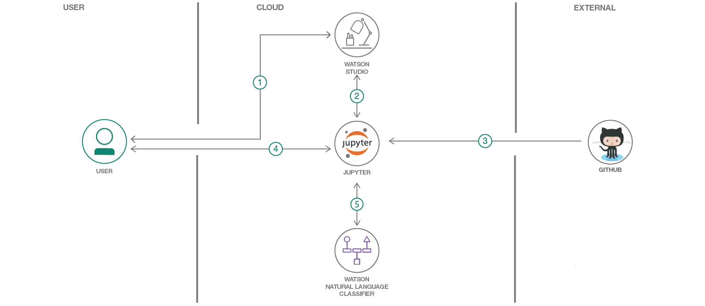

# Programming Language Classification with IBM Watson Studio, Watson, and GitHub

In this Code Pattern, we will use Jupyter Notebooks in IBM Watson Studio to build a model that predicts a code's programming language based on its text. The model will then be evaluated using IBM's Watson Natural Language classifier.

When the reader has completed this Code Pattern, they will understand how to:

* Build a labeled data set.
* Use Watson Natural Language Classifier to create a predictive model.
* Build a predictive model within a Jupyter Notebook.
* Configure and use Watson APIs.

## Flow

1. The developer creates an IBM [Watson Studio Workspace](https://dataplatform.cloud.ibm.com/).
1. Using Watson Studio, the developer creates a Jupyter notebook and [Watson Natural Language Classifier](https://www.ibm.com/watson/services/natural-language-classifier/) instance.
1. User can create a new dataset from Github, or use exsiting one in this repo.
1. User interacts with notebook to Build Naive Bayes Classifier and Natural Language Classifier instance using the [Watson Developer Cloud SDK](https://github.com/watson-developer-cloud)
1. The notebook Python code can use NLC apis to create and use a classifier.

## Included components

* [Watson Studio](https://dataplatform.cloud.ibm.com): Analyze data using RStudio, Jupyter, and Python in a configured, collaborative environment that includes IBM value-adds, such as managed Spark.
* [Jupyter Notebook](https://jupyter.org/): An open source web application that allows you to create and share documents that contain live code, equations, visualizations, and explanatory text.
* [Watson Natural Language Classifier](https://www.ibm.com/watson/services/natural-language-classifier/): Understand the intent behind text passages though custom classifiers, complete with a confidence score.

## Steps

1. [Create IBM Cloud services](#1-create-ibm-cloud-services)
1. [Create a project and add services](#2-create-a-project-and-add-services)
1. [Create a notebook in Watson Studio](#3-create-a-notebook-in-watson-studio)
1. [Run the notebook in Watson Studio](#4-run-the-notebook-in-watson-studio)
1. [Add or change data set](#5-add-or-change-data-set)

### 1. Create IBM Cloud services

Create the following service:

* [Natural Language Classifier](https://cloud.ibm.com/catalog/services/natural-language-classifier)

### 2. Create a project and add services

* Log into IBM's [Watson Studio](https://dataplatform.cloud.ibm.com). Once in, you'll land on the dashboard.

* Create a new project by clicking `+ New project` and choosing `Data Science`:

  

* Enter a name for the project name and click `Create`.

* **NOTE**: By creating a project in Watson Studio a free tier `Object Storage` service and `Watson Machine Learning` service will be created in your IBM Cloud account. Select the `Free` storage type to avoid fees.

  

* Upon a successful project creation, you are taken to a dashboard view of your project. Take note of the `Assets` and `Settings` tabs, we'll be using them to associate our project with any external assets (datasets and notebooks) and any IBM cloud services.

  

* Associate the project with the previously created Natural Language Classifier service. Go to `Settings` tab in the new Project and scroll down to `Associated Services`. Click + and select `Watson` from the drop-down menu. Select an existing `Watson Natural Language Classifier` service or create a new one for free.

* Once your `Natural Language Classifier` (NLC) service is created, copy the credentials and save them for later, when you will use them in your Jupyter notebook.

### 3. Create a notebook in Watson Studio

* From the new project `Overview` panel, click `+ Add to project` on the top right and choose the `Notebook` asset type.

  

* Fill in the following information:

  * Select the `From URL` tab. [1]
  * Enter a `Name` for the notebook and optionally a description. [2]
  * Under `Notebook URL` provide the following url: [https://raw.githubusercontent.com/IBM/programming-language-classifier/master/notebooks/buildmodels.ipynb](https://raw.githubusercontent.com/IBM/programming-language-classifier/master/notebooks/buildmodels.ipynb) [3]
  * For `Runtime` select the `Python 3.5` option. [4]

  

* Click the `Create` button.

* **TIP:** Once successfully imported, the notebook should appear in the `Notebooks` section of the `Assets` tab.

### 4. Run the notebook in Watson Studio

When a notebook is executed, what is actually happening is that each code cell in
the notebook is executed, in order, from top to bottom.

Each code cell is selectable and is preceded by a tag in the left margin. The tag
format is `In [x]:`. Depending on the state of the notebook, the `x` can be:

* A blank, this indicates that the cell has never been executed.
* A number, this number represents the relative order this code step was executed.
* A `*`, this indicates that the cell is currently executing.

* Click the `(►) Run` button to start stepping through the notebook.

* When you get to the cell titled `3.0 Create Classifier with Watson NLC and Evaluate Classification Accuracy`, insert the username and password that you saved from your Watson Natural Language Classifier instance into the code before running it.

* When you get to the cell that says `3.2 Add Classifier ID`, Add the `classifier_id` that is in the output after running `3.1 Create Classifier`.

* Continue running each cell until you finish the entire notebook.

### 5. Add or change data set

* The data used was generated using [`tools/getdata.ipynb`](tools/getdata.ipynb). To use your own or another github repository for analysis, use the `getdata.ipynb` notebook and export the data via HTTP. Point to it in [`notebooks/buildmodels.ipynb`](notebooks/buildmodels.ipynb) section 1.0 using `wget.download()`.

## Sample output

To see the notebook with sample output, load [`examples/exampleNotebook.ipynb`](examples/exampleNotebook.ipynb).

## Learn more

* **Artificial Intelligence Code Patterns**: Enjoyed this Code Pattern? Check out our other [AI Code Patterns](https://developer.ibm.com/technologies/artificial-intelligence/).
* **Data Analytics Code Patterns**: Enjoyed this Code Pattern? Check out our other [Data Analytics Code Patterns](https://developer.ibm.com/technologies/data-science/)
* **AI and Data Code Pattern Playlist**: Bookmark our [playlist](https://www.youtube.com/playlist?list=PLzUbsvIyrNfknNewObx5N7uGZ5FKH0Fde) with all of our Code Pattern videos

## License

This code pattern is licensed under the Apache Software License, Version 2.  Separate third party code objects invoked within this code pattern are licensed by their respective providers pursuant to their own separate licenses. Contributions are subject to the [Developer Certificate of Origin, Version 1.1 (DCO)](https://developercertificate.org/) and the [Apache Software License, Version 2](https://www.apache.org/licenses/LICENSE-2.0.txt).

[Apache Software License (ASL) FAQ](https://www.apache.org/foundation/license-faq.html#WhatDoesItMEAN)
